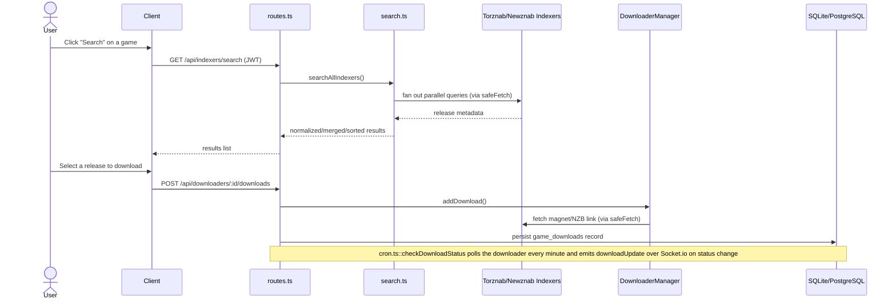
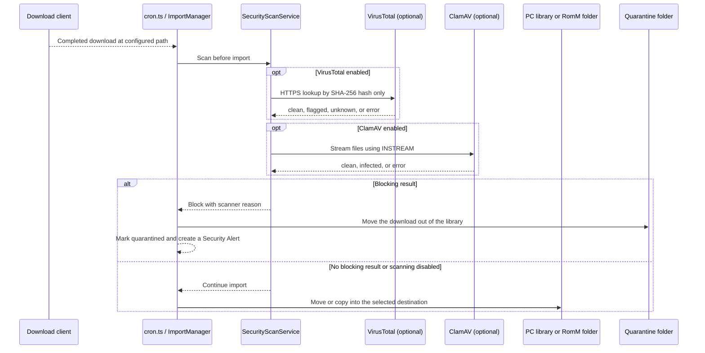

# System Architecture & Actors

This document describes QuestarrNG's system design: the actors (subsystems and
external entities that can influence one another) and the data flows between
them. It complements [`CLAUDE.md`](https://github.com/Doezer/Questarr/blob/main/CLAUDE.md), which covers code-level
conventions rather than system design, and [`docs/API.md`](API.md) /
[`docs/SECURITY_ASSESSMENT.md`](SECURITY_ASSESSMENT.md), which cover the
external interface and risk-assessment angles of the same system.

**Update policy:** update this document whenever a PR introduces a new actor
(a new external integration, download client, or background job) or changes
how data flows between existing actors.

## 1. Overview

QuestarrNG is a three-layer TypeScript application in a single `package.json`
(not a monorepo):

- **`/client`** — a React 18 single-page app (Wouter routing, TanStack Query
  for server state).
- **`/server`** — an Express REST API plus a Socket.io WebSocket channel.
- **`/shared`** — the Drizzle ORM schema and Zod validation schemas used by
  both sides.

The client never talks to the database, external services, or download
clients directly — every action is mediated by the server, which is the
system's central trust boundary (§8).

## 2. System actors

An "actor" here is any subsystem or entity that can influence another part
of the system — by writing data, triggering a request, or emitting an event.

| Actor                                                                                                                                                        | Role                                                                                       | What it can influence                                                                                                                                                     |
| ------------------------------------------------------------------------------------------------------------------------------------------------------------ | ------------------------------------------------------------------------------------------ | ------------------------------------------------------------------------------------------------------------------------------------------------------------------------- |
| End User (browser)                                                                                                                                           | Initiates all user-facing actions                                                          | Client SPA, via HTTP requests and Socket.io connection                                                                                                                    |
| Client (React SPA)                                                                                                                                           | Renders UI, holds a JWT                                                                    | Server, via REST calls with `Authorization: Bearer <JWT>`                                                                                                                 |
| Server — routes (`server/routes.ts`, `server/steam-routes.ts`, `server/pcgamingwiki-router.ts`, `server/routes/integration.ts`, `server/routes/api-keys.ts`) | Validates input, orchestrates business logic                                               | Storage layer, downloaders, search, Socket.io                                                                                                                             |
| Server — `auth.ts`                                                                                                                                           | Issues/verifies JWTs, hashes passwords, mints/validates integration API keys               | Storage (`system_config` for the JWT secret; `api_keys` table), request `req.user`                                                                                        |
| Playnite extension (`extensions/playnite-questarr/`)                                                                                                         | External couch-PC client                                                                   | Server, via `/api/integration` (through an API key, not a JWT) — pushes the local library, requests games                                                                 |
| SeerrNG server                                                                                                                                               | External catalog and PC-acquisition client                                                 | Server, via the versioned `/api/integration/seerrng/v1` provider API and a scoped integration key or JWT                                                                  |
| Server — `storage.ts` (Drizzle ORM)                                                                                                                          | Sole application reader/writer for the configured relational database                      | SQLite or PostgreSQL database                                                                                                                                             |
| SQLite / PostgreSQL database                                                                                                                                 | Persists all app state                                                                     | Read and written by server modules through `storage.ts`                                                                                                                   |
| Server — `ssrf.ts` (`safeFetch`)                                                                                                                             | Validates and pins outbound URLs                                                           | Every outbound HTTP(S) call to indexers, downloaders, and most metadata services                                                                                          |
| Server — `cron.ts` (scheduler)                                                                                                                               | Runs unattended background jobs                                                            | Storage, IGDB, indexers (via `search.ts`), downloaders, Socket.io                                                                                                         |
| Server — `socket.ts` (Socket.io)                                                                                                                             | Pushes real-time events                                                                    | Client SPA (owner's `user:<id>` room for notifications, broadcast to authenticated sockets otherwise)                                                                     |
| Server — `search.ts`                                                                                                                                         | Orchestrates indexer search, applies filtering/dedup                                       | Torznab/Newznab indexers (read), routes/cron (results)                                                                                                                    |
| Server — `downloaders.ts` (`DownloaderManager`)                                                                                                              | Abstracts the 5 download-client integrations                                               | qBittorrent/Transmission/rTorrent/SABnzbd/NZBGet (write: submit; read: status)                                                                                            |
| Server — `library-scanner.ts` / `root-folders.ts`                                                                                                            | Discovers games already on disk in user-configured root folders (outside the library root) | Reads the local filesystem directly (not via `safeFetch` — local paths, not URLs); queries IGDB for matching; writes `games`/`game_files`/`root_folders` via `storage.ts` |
| Server — `ImportManager` / `SecurityScanService`                                                                                                             | Plans and performs imports; optionally scans downloads before they enter a library         | Configured PC library or RomM folder; VirusTotal hash lookup; configured ClamAV daemon; quarantine folder                                                                 |
| RomM library folders (shared filesystem)                                                                                                                     | ROM destination for configured platform mappings                                           | Read/write filesystem operations from the QuestarrNG server; QuestarrNG does not call the RomM API                                                                        |
| IGDB (via Twitch OAuth)                                                                                                                                      | External game-metadata provider                                                            | Server, via `server/igdb.ts` (through `safeFetch`) — read-only queries; also drives `cron.ts::checkGameUpdates`                                                           |
| HowLongToBeat                                                                                                                                                | External gameplay-length provider                                                          | Server, via `server/hltb.ts` (through `safeFetch`)                                                                                                                        |
| NexusMods                                                                                                                                                    | External mod-listing provider                                                              | Server, via `server/nexusmods.ts` (through `safeFetch`)                                                                                                                   |
| Steam Web API                                                                                                                                                | External wishlist provider                                                                 | Server, via `server/steam.ts` / `server/steam-routes.ts` (through `safeFetch`), keyed by user-supplied `steamId64`                                                        |
| PCGamingWiki                                                                                                                                                 | External wiki-lookup provider                                                              | Server, via `server/pcgamingwiki-router.ts` (through `safeFetch`), keyed by Steam App ID                                                                                  |
| Torznab/Newznab indexers (user-configured)                                                                                                                   | External release-search providers                                                          | Server, via `search.ts` (through `safeFetch`); user-supplied URL/API key                                                                                                  |
| qBittorrent / Transmission / rTorrent / SABnzbd / NZBGet (user-configured)                                                                                   | External download clients                                                                  | Server, via `downloaders.ts` (through `safeFetch`); user-supplied host/credentials                                                                                        |
| xREL.to                                                                                                                                                      | External scene-release monitor                                                             | Server, via `server/xrel.ts`, driven by `cron.ts::checkXrelReleases`                                                                                                      |
| VirusTotal                                                                                                                                                   | Optional hash-reputation lookup                                                            | Server sends a file's SHA-256 hash over HTTPS; file contents are not uploaded                                                                                             |
| ClamAV daemon (user-configured)                                                                                                                              | Optional local/network malware scanner                                                     | Server streams file contents over ClamAV's INSTREAM protocol to the configured, DNS-validated address                                                                     |

## 3. High-level data flow

```mermaid
flowchart TB
    User["End User (Browser)"]

    subgraph Client["Client (React SPA)"]
        UI["React Components + TanStack Query"]
    end

    subgraph Server["Server (Express)"]
        Routes["routes.ts / steam-routes.ts / pcgamingwiki-router.ts"]
        Auth["auth.ts (JWT)"]
        Storage["storage.ts (Drizzle ORM)"]
        SSRF["ssrf.ts (safeFetch)"]
        Cron["cron.ts (scheduler)"]
        Socket["socket.ts (Socket.io)"]
        SearchOrch["search.ts (indexer orchestration)"]
        DLManager["downloaders.ts (DownloaderManager)"]
        Import["ImportManager"]
        Scan["SecurityScanService"]
    end

    DB[("SQLite or PostgreSQL (Drizzle)")]

    subgraph Metadata["Metadata & Discovery Services"]
        IGDB["IGDB (Twitch OAuth)"]
        HLTB["HowLongToBeat"]
        Nexus["NexusMods"]
        Steam["Steam Web API"]
        PCGW["PCGamingWiki"]
    end

    subgraph Indexers["Indexers (user-configured)"]
        Torznab["Torznab / Newznab feeds"]
    end

    subgraph Downloaders["Download Clients (user-configured)"]
        QB["qBittorrent"]
        TR["Transmission"]
        RT["rTorrent"]
        SAB["SABnzbd"]
        NZB["NZBGet"]
    end

    subgraph Integrations["External clients and import targets"]
        Playnite["Playnite extension"]
        SeerrNG["SeerrNG"]
        RomM["RomM library folder (shared mount)"]
        PCGames["PC game library folder"]
        Quarantine["Quarantine folder"]
    end

    subgraph Scanners["Optional malware scanners"]
        VT["VirusTotal (SHA-256 lookup)"]
        ClamAV["ClamAV daemon (INSTREAM)"]
    end

    User <--> UI
    UI <--> Routes
    Playnite <--> Routes
    SeerrNG <--> Routes
    Routes --> Auth
    Routes --> Storage
    Storage <--> DB
    Routes --> SearchOrch
    SearchOrch --> SSRF
    SSRF --> Torznab
    Routes --> DLManager
    DLManager --> SSRF
    DLManager --> Import
    Import --> Scan
    Scan -->|hash only| VT
    Scan -->|file stream| ClamAV
    Scan -->|flagged| Quarantine
    Scan -->|clear or scans disabled| Import
    Import --> PCGames
    Import --> RomM
    SSRF --> QB
    SSRF --> TR
    SSRF --> RT
    SSRF --> SAB
    SSRF --> NZB
    Routes --> SSRF
    SSRF --> HLTB
    SSRF --> Nexus
    SSRF --> Steam
    SSRF --> PCGW
    SSRF --> IGDB

    Cron --> Storage
    Cron -->|checkGameUpdates| IGDB
    Cron -->|checkAutoSearch| SearchOrch
    Cron -->|checkDownloadStatus| DLManager
    Cron -->|checkXrelReleases| Storage
    Cron --> Socket
    Routes --> Socket
    Socket -.->|notification, downloadUpdate| UI
```

## 4. Example flow: search, select a release, download

### 4.2 Example flow: completed download → scan → library import

VirusTotal receives the selected file's hash rather than its contents. ClamAV
receives file contents when enabled. A flagged download is moved to a sibling
`.questarr-quarantine` directory and cannot be imported through the normal
review route. See [`docs/THREAT_MODEL.md`](THREAT_MODEL.md) §4.5 for scanner
failure and partial-scan behavior.

## 5. Request/response flow

JSON REST calls follow the same path: **Client or integration → routes
(`server/routes.ts` et al., validated via `express-validator`/Zod) →
`storage.ts` (Drizzle ORM queries against `shared/schema.ts`) → JSON response.**
The SeerrNG asset-streaming routes are the exception: they stream a registered
imported file, or a gzip tar of multiple registered files, after ownership and
path checks. Bundle entry names are sanitized and made unique. Routes never touch
the database directly — all reads/writes go through `storage.ts`, which is
the only module importing the Drizzle `db` client for application data.

## 6. Out-of-band channel: Socket.io

`server/socket.ts` gates every connection with an `io.use` handshake check
(`server/socket.ts:32-50`): the socket must carry the auth cookie (from a
trusted Origin) or a bearer token that `verifyAuthToken` accepts, otherwise
the handshake is rejected with "Authentication required". On a successful
handshake the socket joins a per-user room, `user:<id>`, before the
connection completes, so a notification fired right after connect can't miss
it.

`notifyUser(type, payload, userId?)` (`server/socket.ts:149-162`) routes
events in one of two ways:

- **With an owner** (`userId` set): `io.to("user:<id>").emit(type, payload)`.
  Only that user's sockets receive the event. Every `notification` emit
  passes the notification's `userId`, so in-app notifications reach only the
  account that owns them.
- **Without an owner** (`userId` omitted or null): `io.emit(type, payload)`,
  a broadcast to every authenticated socket. Ownerless notifications and
  app-wide events (`downloadUpdate`, `importTaskUpdate`, `gameUpdated`,
  `library-scan-progress`, and the `logLine` log stream) still go to
  everyone.

The remaining broadcasts are consistent with §9: Questarr's supported
deployment is one trusted operator per instance, so cross-account
broadcast of app-wide state is not a hardened boundary today. The main
event types are:

- `"notification"` — emitted from both `cron.ts` (game updates, download
  completion, auto-search results, xREL matches) and `routes.ts`; consumed by
  `client/src/components/NotificationCenter.tsx`.
- `"downloadUpdate"` — emitted from `cron.ts::checkDownloadStatus` whenever a
  tracked download's status changes; consumed by
  `client/src/components/GameDetailsModal.tsx` to refresh download state for
  the affected game.

## 7. Scheduled/background actors (cron jobs)

`server/cron.ts::startCronJobs()` schedules seven recurring `setInterval`
jobs. The five primary sync/check jobs below also run once on an initial
10-second delayed startup; `startCronJobs()` additionally runs
`logClientVersions` (every 12 hours, probes configured indexer/downloader
client versions for logging) and a daily import-task cleanup (deletes
`import_tasks` rows older than 30 days), neither of which reads/writes
domain data covered by this table:

| Job                   | Interval                                                                                  | Upstream read                                                                           | Downstream write                                                                                                 |
| --------------------- | ----------------------------------------------------------------------------------------- | --------------------------------------------------------------------------------------- | ---------------------------------------------------------------------------------------------------------------- |
| `checkGameUpdates`    | 24 hours                                                                                  | IGDB (batch fetch by ID)                                                                | `games` table (release date/status), `notifications` table, Socket.io `notification`                             |
| `checkDownloadStatus` | 1 minute                                                                                  | Configured download clients (via `DownloaderManager`)                                   | `game_downloads`/`games` status, `notifications`, Socket.io `downloadUpdate`/`notification`                      |
| `checkAutoSearch`     | 1 hour (per user, gated by their configured search interval)                              | Torznab/Newznab indexers (via `search.ts`), download clients (if auto-download enabled) | `games` search-results flag, `game_downloads`, `notifications`, Socket.io `notification`                         |
| `checkXrelReleases`   | 6 hours                                                                                   | xREL.to latest releases                                                                 | `xrel_notified_releases`, `notifications`, Socket.io `notification`                                              |
| `checkSteamWishlist`  | 1 hour (per user, gated by their configured sync interval, opt-in via `steamSyncEnabled`) | Steam Web API wishlist, IGDB (Steam App ID lookup)                                      | `games` table (new/linked entries), `import_tasks`, `notifications`, Socket.io `importTaskUpdate`/`notification` |

Steam wishlist sync (`syncUserSteamWishlist` in `server/cron.ts`) also runs
on-demand when a user explicitly triggers it via
`POST /api/steam/wishlist/sync` (`server/steam-routes.ts:37-56`). The
scheduled path is opt-in per user (`userSettings.steamSyncEnabled`, default
`false`) with a configurable interval (`userSettings.steamSyncIntervalHours`,
default 24) tracked via `userSettings.lastSteamSync`.

## 8. Trust boundaries

- **Browser ↔ Server** is the primary trust boundary. The client is treated
  as fully untrusted; every write path is re-validated server-side
  (`express-validator`/Zod) regardless of client-side checks, and all
  non-public routes require a valid JWT (`authenticateToken`,
  `server/auth.ts:104-126`).
- **Server ↔ third-party services** is a secondary boundary, mediated by
  `server/ssrf.ts::safeFetch` for outbound calls whose target host is wholly
  or partly user-supplied (indexers, download clients, HowLongToBeat,
  NexusMods, Steam, PCGamingWiki). `safeFetch` blocks link-local/cloud-
  metadata/broadcast ranges unconditionally, and re-validates every resolved
  IP to guard against DNS rebinding (`server/ssrf.ts:4-18,181-249`).
  `allowPrivate` defaults to `true` (`server/ssrf.ts:19-22,86`), i.e. private/
  loopback ranges are reachable by design — QuestarrNG is meant to be
  self-hosted alongside indexers/downloaders that often live on the same
  LAN.
- `server/igdb.ts` also routes its Twitch/IGDB requests through `safeFetch`,
  consistent with every other integration, even though the target host
  (`api.igdb.com`/`id.twitch.tv`) is hardcoded rather than user-supplied —
  applied as defense in depth rather than out of SSRF necessity.

See [`docs/THREAT_MODEL.md`](THREAT_MODEL.md) for a more detailed attack-surface
analysis of these trust boundaries (per-integration trust table, high-risk
data flows, and the unauthenticated-route inventory).

## 9. Multi-user status

**QuestarrNG is not, and is not planned to become, a multi-user application
for the foreseeable future.** The supported deployment is one trusted
operator per instance (see [`docs/PRD.md`](PRD.md) §6 Non-Goals and §8
Technical Constraints, and [`../GOAL-product.md`](https://github.com/Doezer/Questarr/blob/main/GOAL-product.md)).

The schema and auth layer nonetheless have partial multi-account
_plumbing_, which predates this decision and should not be read as a
roadmap signal: a `users` table exists, `authenticateToken` resolves a
per-request `req.user.id` from a JWT, and personal-library tables
(`games`, `user_settings`, `notifications`, `import_tasks`, `api_keys`,
`release_blacklist`) carry a `userId` column. Instance-wide config and
shared runtime state — `indexers`, `downloaders`, `root_folders`,
`rss_feeds`, `game_downloads` — deliberately carry **no** `userId`, since
they represent one server's shared configuration, not per-account data.

Because of this, account isolation is inconsistent by design, not a defect
to eliminate wholesale:

- Some code paths do scope by `userId` (e.g. `resolveOwnedGame` in
  `routes.ts`, and the igdbId-reuse checks before reusing an existing game
  record), because getting those specific paths right also happens to be
  good practice regardless of user count.
- Others intentionally don't: `notifyUser()` still broadcasts app-wide
  Socket.io events (download, import, and scan progress) to every connected
  client, though owned notifications go only to their user's room (§6);
  `library-scanner.ts`'s scan state
  (`getAllUnmatched`, `getAllScanProgress`) is global, matching `root_folders`
  being global; download clients and indexers are shared instance
  configuration, not per-user.
- The trust model is flat with no RBAC/admin split (see
  [`docs/THREAT_MODEL.md`](THREAT_MODEL.md) §8, "Flat, single-tier trust
  model" — accepted risk).

**For review purposes:** a finding that one authenticated account can read
or influence another account's data on the same instance is not, by
itself, a release-blocking vulnerability under this deployment model —
QuestarrNG has exactly one intended operator per instance. It's still fine
to close such a gap opportunistically when already touching that code
(consistency and defense-in-depth have value even here), but it should not
be treated as urgent, and should not be used to justify widening a PR's
scope. If the multi-user goalposts ever move, that will be a deliberate,
separately-scoped product decision — not something to infer from the
partial `userId` scoping already present in the schema.
